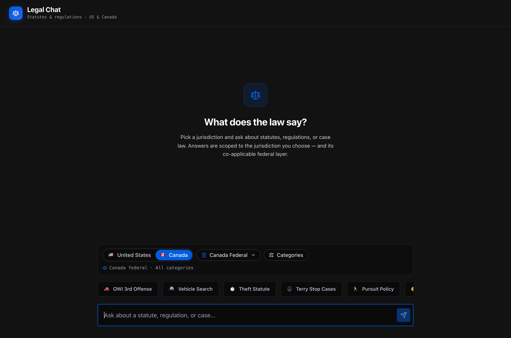
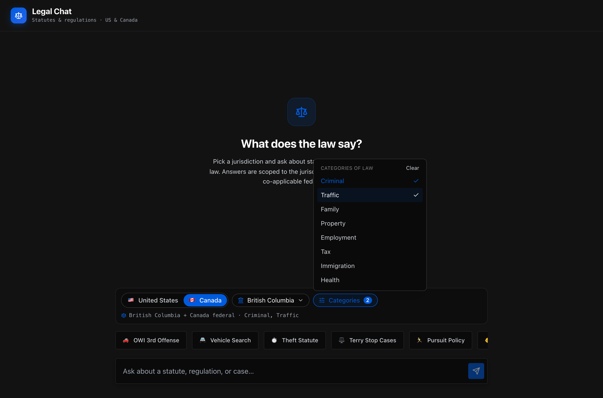

# Legal Chat — US & Canada Legal RAG

A Retrieval-Augmented Generation (RAG) system for querying **statutes and regulations across US and Canadian jurisdictions**. Pick a jurisdiction and one or more categories of law, ask a question, and get an answer grounded only in the law that applies there — including the co-applicable federal layer.



Choosing **British Columbia** scopes retrieval to BC **plus** Canadian federal law, and the category menu filters by area of law:



---

## What it does

- **Multi-jurisdiction scoping (MVP):** US federal, Canada federal, and British Columbia. A sub-national jurisdiction automatically includes its country's federal layer, and a query is **hard-filtered** so law from another jurisdiction never leaks into the answer.
- **Category-of-law filtering:** a controlled, cross-jurisdiction vocabulary (criminal, traffic, family, tax, …) applied at ingestion and used as a retrieval filter.
- **Official-source ingestion:** data comes from official, machine-readable government sources through per-source adapters — not scraped from aggregators.
- **Sleek dark UI:** jurisdiction + category scope bar, live scope summary, and a cited, confidence-scored chat answer.

## Status

The pipeline is built and tested through the UI. The only step that needs an OpenAI key is the live embed/index + chat (Stage 7).

| Stage | Scope | Status |
|-------|-------|--------|
| 1. Domain foundation | Jurisdiction taxonomy, category taxonomy, source registry | ✅ Done |
| 2. Environment | Modernized for Python 3.14 | ✅ Done |
| 3. Retrieval filtering | Jurisdiction/category metadata + hard isolation | ✅ Done |
| 4. Source adapters | `govinfo` (US fed), `justice_laws` (CA fed), `bc_laws` (BC) | ✅ Done |
| 5. Ingestion CLI | Download → parse → chunk → embed (cached) → index | ✅ Done |
| 6. UI / UX | Country + jurisdiction + category selection | ✅ Done |
| 7. End-to-end | Embed + index corpus, live scoped chat | ⏳ Needs `OPENAI_API_KEY` |

> **Decision record:** the full rationale for every architecture choice (data acquisition, storage, vector DB, refresh, isolation, taxonomy, versioning, embedding cost, compliance) is in [documentation/PIPELINE_UPGRADE_DECISIONS.md](documentation/PIPELINE_UPGRADE_DECISIONS.md).

## Data sources

| Jurisdiction | Source | Format | Adapter |
|---|---|---|---|
| US federal | [govinfo](https://www.govinfo.gov/bulkdata) (US Code) | USLM XML | `govinfo` |
| Canada federal | [Justice Laws](https://github.com/justicecanada/laws-lois-xml) (consolidated Acts) | XML | `justice_laws` |
| British Columbia | [BC Laws](https://www.bclaws.gov.bc.ca/bclawsapi.html) (CiviX API) | XML / XHTML | `bc_laws` |

All are official, open/public-domain sources. CanLII is intentionally **not** used (its terms prohibit bulk access). See the FAQ in the decision record for links and licensing notes.

---

## Project structure

```
LawRAG/
├── backend/              # FastAPI backend
│   ├── jurisdictions.py  # jurisdiction taxonomy + federal-overlap resolver
│   ├── categories.py     # category vocabulary + classifier
│   ├── ingestion/        # adapters, source registry, chunking, pipeline, cache
│   ├── retrieval/        # vector store, hybrid search, context building
│   └── generation/       # LLM client, prompts, safety
├── frontend/             # Next.js 14 + TypeScript + Tailwind
├── scripts/ingest.py     # ingestion CLI (list / download / ingest)
├── data/raw/             # downloaded source corpora (bulk corpora gitignored)
└── documentation/        # architecture, decisions, performance, screenshots
```

## Setup

### Prerequisites
- Python 3.11+ (tested on 3.14)
- Node.js 18+

### Backend
```bash
python -m venv venv
source venv/bin/activate            # Windows: venv\Scripts\activate
pip install -r requirements.txt
cp env.example .env                 # then set OPENAI_API_KEY in .env
```

Run the API:
```bash
PYTHONPATH=. uvicorn backend.main:app --reload
# API: http://localhost:8000  ·  docs: http://localhost:8000/docs
```

### Frontend
```bash
cd frontend
npm install
npm run dev                         # http://localhost:3000
```

The frontend reads `NEXT_PUBLIC_API_URL` (defaults to `http://localhost:8000`).

## Ingestion

The pipeline is a decoupled CLI (`scripts/ingest.py`). `list` and `download` need no API key; `ingest` embeds and therefore needs `OPENAI_API_KEY`.

```bash
# See which sources are approved + active
python scripts/ingest.py list

# Download a source's bulk data into data/raw/<id>
python scripts/ingest.py download ca-justice-laws

# Parse → chunk → embed → index (use --limit for a cheap first run)
python scripts/ingest.py ingest --source ca-justice-laws --limit 25
```

- **Latest-only:** re-ingesting a document replaces its prior chunks.
- **Content-hash cache:** unchanged documents are skipped and never re-embedded.
- **In-force only:** repealed / not-yet-in-force law is skipped at parse time.

## Testing

```bash
# Backend (from repo root)
PYTHONPATH=. venv/bin/python -m pytest backend/tests/ -q

# Frontend
cd frontend && npm test
```

## Tech stack

- **Backend:** FastAPI, Pydantic, ChromaDB (pgvector-ready abstraction), OpenAI embeddings + LLM, lxml / pdfplumber / BeautifulSoup for parsing.
- **Frontend:** Next.js 14, TypeScript, Tailwind CSS, Radix UI (Select + Popover), lucide-react, Vitest.

## Documentation
- [documentation/PIPELINE_UPGRADE_DECISIONS.md](documentation/PIPELINE_UPGRADE_DECISIONS.md) — architecture decision record + build roadmap
- [documentation/ARCHITECTURE.md](documentation/ARCHITECTURE.md) — system architecture
- [documentation/EXPLANATION.md](documentation/EXPLANATION.md) — implementation details
- [documentation/PERFORMANCE_METRICS.md](documentation/PERFORMANCE_METRICS.md) — evaluation methodology

## License

This is a personal project.
